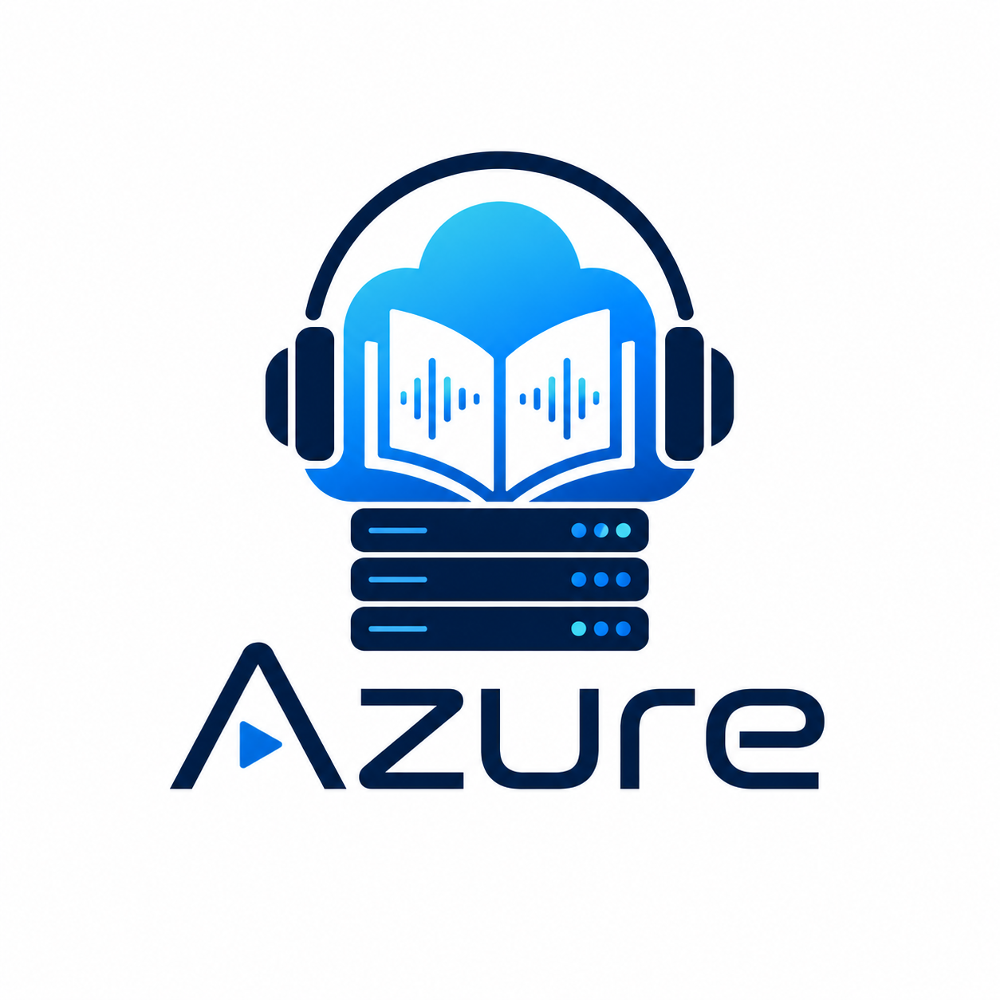

# Azure Audiobooks

A modern, self-hosted audiobook streaming platform designed for performance and ease of use. Stream your personal audiobook collection to any device via a clean, responsive web interface.



## 🚀 Features

- **Self-Hosted Streaming:** Access your library from anywhere via a web browser.
- **Dockerized Architecture:** Easy deployment using Docker Compose.
- **External Volume Support:** Seamless integration with network shares (SMB/CIFS) via Docker volumes.
- **Metadata Management:** Automatic scanning and metadata extraction for your audiobooks.
- **User Progress Tracking:** Sync your listening progress across multiple devices.
- **Admin Dashboard:** Manage users, libraries, and system settings.
- **Progressive Web App (PWA):** Installable on mobile devices for a native-like experience.

## 🛠 Tech Stack

- **Frontend:** React 19, TypeScript, Vite, Lucide React, Socket.io-client.
- **Backend:** Node.js 22, Express 5, Socket.io, Prisma ORM.
- **Database:** PostgreSQL (Supabase compatible).
- **Processing:** FFmpeg (for metadata and streaming), Tone (for audio processing).
- **Deployment:** Nginx (static serving & reverse proxy), Docker.

## 📦 Installation

### Prerequisites

- Docker and Docker Compose installed.
- A PostgreSQL database (e.g., Supabase).
- An existing Docker volume named `Audiobooks` (if using network storage).

### Environment Variables

Create a `.env` file or set these in your container orchestrator (like Portainer):

| Variable | Description | Default |
| :--- | :--- | :--- |
| `DATABASE_URL` | PostgreSQL connection string | Required |
| `DIRECT_URL` | Direct PostgreSQL connection string | Required |
| `JWT_SECRET` | Secret key for auth tokens | Recommended |
| `CLIENT_ORIGIN` | Allowed CORS origin (your public domain) | `http://localhost:8080` |
| `PORT_CLIENT` | External port for the web UI | `8080` |
| `EXTERNAL_FETCH_TIMEOUT_MS` | Timeout for Audible, Google Books, Goodreads, and cover requests | `20000` |
| `METADATA_SEARCH_CACHE_TTL_MS` | In-memory metadata result cache lifetime | `300000` |

> **Note for Supabase users:** If using the connection pooler (port 6543), append `&statement_cache_size=0` to your `DATABASE_URL`.

### Deployment

1. **Clone the repository:**
   ```bash
   git clone https://github.com/ddloads/azure-audiobooks.git
   cd azure-audiobooks
   ```

2. **Start the stack:**
   ```bash
   docker-compose up -d
   ```

3. **Seed the database (First run):**
   ```bash
   docker exec -it azure-server npx prisma db seed
   ```
   *Default Credentials:* `admin` / `admin123`

## 🌐 Networking

The project is designed to work behind reverse proxies like **Cloudflare Tunnels**. 

- **Client Port:** `9000` (configurable via `PORT_CLIENT`)
- **Server Port:** `4000` (internal API, also exposed)

The client container handles proxying `/api` and `/socket.io` requests to the server internally, so you only need to point your public hostname (e.g., `azure.yourdomain.com`) to the client's host IP and port (e.g., `http://192.168.1.219:9000`).

## 📁 Volume Mapping

- `/app/data`: Stores application data, logs, and local covers.
- `/app/library`: Maps to your audiobook collection (mapped to the external `Audiobooks` volume by default).

## 📄 License

This project is licensed under the ISC License.
